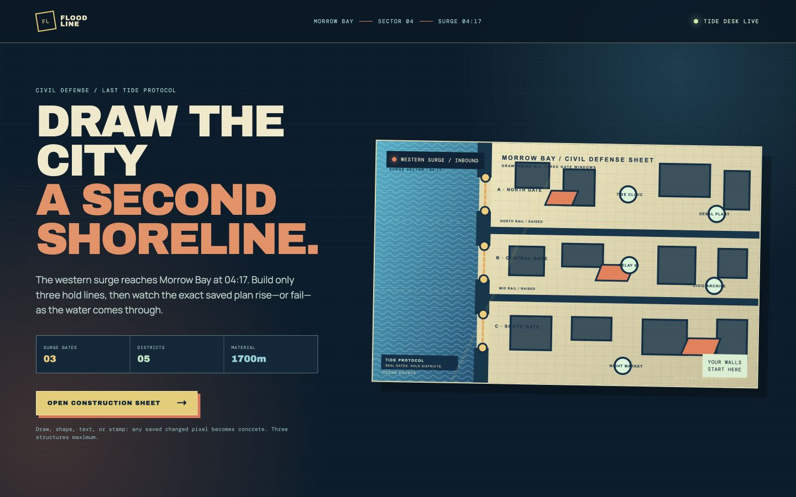
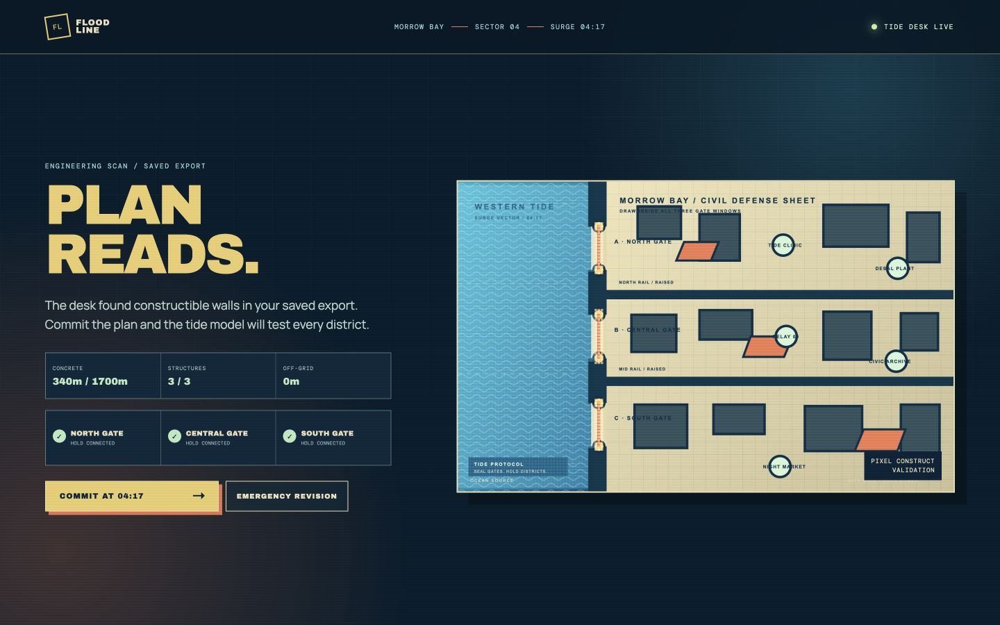
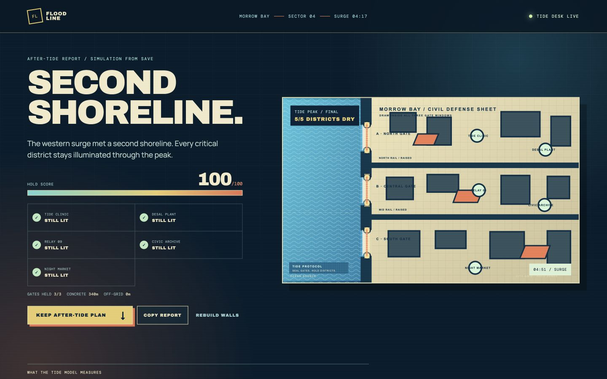

# FLOODLINE — Last Tide

> Draw the city a second shoreline.

**FLOODLINE — Last Tide** is an original, fictional coastal open-world emergency experience built for Unlayer’s React Image Editor challenge. At 04:17, a western surge will breach three gates in Morrow Bay. The player opens the construction sheet in React Image Editor, saves three visible hold lines, then watches those **exact exported pixels** become barriers in a deterministic tide model.

The interaction is deliberately construction, not cosmetic customization: remove the editor and there is no game.

## Why this entry

The challenge asks for an original GTA VI-inspired experience with React Image Editor at its core. FLOODLINE takes the freedom, danger, and bright coastal tension of an open-world city without borrowing Grand Theft Auto assets, names, characters, branding, maps, or UI.

Its loop is intentionally small and complete:

1. Receive a fictional civil-defense sheet for Morrow Bay.
2. Draw a vertical wall inside each of the three amber gate windows.
3. Save from React Image Editor.
4. Read the engineering scan: concrete length, structures, off-grid changes, and each gate’s status.
5. Commit the saved construction plan and watch the tide reach—or fail to reach—five named districts.
6. Keep the after-tide plan or copy a share-ready result.

The result gives the editor a real consequence rather than placing a saved image into a static mockup.

## Screenshots

| Briefing | Saved-plan scan | After-tide result |
| --- | --- | --- |
|  |  |  |

The mobile briefing is also captured in [`docs/screenshots/mobile-brief.jpg`](docs/screenshots/mobile-brief.jpg). The editor offers a rotate-for-precision prompt on narrow portrait screens.

## React Image Editor is the game mechanic

`@unlayer/react-image-editor` is embedded in the primary journey. The project provides a same-origin original map and exposes Draw, Text, Shapes, and Stickers. Players can use any of those tools, but only visible saved changes become material in the model.

On save, the app:

- checks the editor’s `hasChanges()` result;
- loads the returned `dataUrl` together with the original map;
- compares the two pixel frames, ignoring normal JPEG edge noise from the editor export;
- reduces meaningful changed pixels to a 10 × 10px construction grid;
- floods a deterministic fictional city grid around those barriers; and
- renders the saved export underneath the animated tide result.

It does not infer intent, draw order, real-world engineering quality, or real flood risk. This is a transparent, stylized game model.

## Run locally

```bash
npm install
npm run dev
```

Then open the local URL Vite prints. A recent Node.js 18+ runtime is required.

```bash
npm test
npm run lint
npm run build
```

## Project structure

```text
src/App.tsx       Experience flow, editor integration, result UI, tide overlay
src/sim.ts        Pixel comparison, construction validation, deterministic flood model
src/sim.test.ts   Behaviour tests for unchanged, partial, winning, and invalid plans
public/map/       Original source map (SVG) and canonical runtime PNG
docs/             Provenance, competition audit, concept decision, submission copy
```

## Originality and assets

Everything visible in the product world is original for this project: Morrow Bay, the civil-defense fiction, the map drawing, interface treatment, copy, flood simulation, and CSS illustration. The starter sheet was authored as [`public/map/floodline-sheet.svg`](public/map/floodline-sheet.svg) and rasterized locally to the PNG the editor receives. There are no Rockstar, Take-Two, GTA VI, leaked, competitor, stock-photo, or generative-image assets in the runtime bundle.

The app loads the editor’s embed from Unlayer’s CDN as designed by the package. Google Fonts are an optional visual enhancement; local system fallbacks remain available. Details are in [the asset provenance ledger](docs/asset-provenance.md).

## Competition notes

- This is a new, standalone project; it does not modify `saltline-dispatch` or any other entry in the workspace.
- No external APIs, accounts, tracking, auth, paid features, AI Assistant, or secrets are required.
- The README shows the complete experience and the public source will visibly show the editor integration.
- Before publishing, recheck the official challenge FAQ/form for deadline and eligibility changes, make the repository public, deploy it, and submit its own form entry.

See [competition audit](docs/competition-audit.md), [submission kit](docs/submission-kit.md), and [STATUS.md](STATUS.md) for the exact readiness state.

## License

MIT. The React Image Editor dependency remains subject to its own MIT license.
